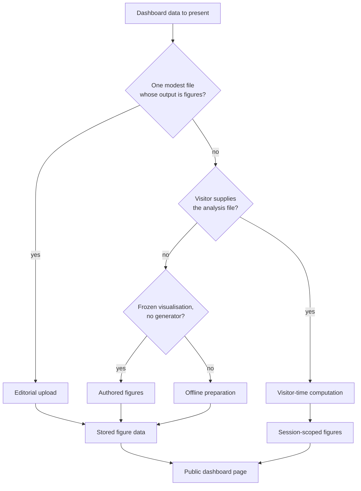

# 14. Dashboard data-flow strategy

**Date**: 2026-09-16

**Updated**: 2026-09-21

## Status

Proposed

## Related ADRs

- [0004 – Visualisation tool for dashboards](0004-visualisation-tool-for-dashboards.md)
- [0007 – Data hosting architecture](0007-data-hosting-architecture.md)
- [0012 – Data processing tools for visualisations](0012-data-processing-tools-for-visualisations.md)
- [0013 – Serving static and media files](0013-serving-static-and-media-files.md)

## Context

Portal dashboards turn research-supplied data into Plotly figures that a page can show (ADR-0004). How that data *enters* the portal is a separate concern from how figures are drawn, from which libraries transform tabular inputs (ADR-0012), and from how the portal discovers or hosts unit data bundles (ADR-0007). Persistent files produced on these paths are served as media, not as application static assets (ADR-0013).

In practice, dashboards do not share one ingestion shape:

- Most updating dashboards are fed by an editor with a single, modest source file. Figures can be produced as part of that editorial save and stored for later page views.
- Some dashboards are visitor-driven: the person viewing the page supplies the analysis file, and figures are computed for that session rather than once for everyone.
- Some historic dashboards no longer have a live generator. Their figures are stored as finished visualisation data and are not rebuilt from a source file on each edit.
- A smaller set of resource-style dashboards are fed by several large inputs, produce a large derived artefact set for download as well as figures, and cannot reasonably be absorbed or processed inside an editorial request.

A single “upload one file, generate figures in the same request, store only figures” path therefore cannot cover every dashboard we already operate. This record describes the strategy we have already adopted, so that future dashboards can be placed on an existing path instead of inventing a new one by default.

## Decision

We use **several data-flow paths**, chosen according to the shape, size, processing needs, and lifecycle of the data — not according to a preference for one pipeline.

**Editorial upload.** One source file, small enough to validate and parse during an admin save, whose useful output is figure data (and optionally that same file for visitor download). Generation runs as part of the save. Format may vary as long as the “one file, request-sized, figures only” assumptions still hold. Examples: Serology statistics, SLU wastewater, regional SARS-CoV-2 variants (Uppsala), and Recovac.

**Offline preparation.** Several inputs, files too large for an editorial request, or a derived artefact set that must persist on disk and be downloaded as files — not only as figures. Preparation is a deliberate, repeatable batch step. The page then reads the prepared figures and points downloads at the prepared artefacts. Example: the Drug Repurposing Resource (DRR) dataset pages.

**Visitor-time computation.** The chart depends on a file the visitor provides. Reference material may be bundled with the application; the visitor’s file is session-scoped and is not the editorial source of record for the dashboard. Figures for that visit are computed at request time rather than stored for every visitor. Example: the DINA Liver Resource, whose interactive analysis is driven by the visitor’s differential-expression file.

**Authored figures.** There is no live generation step. Editors store finished figure data. Used for historic or frozen visualisations. Examples: historic influenza and SARS-CoV-2 wastewater, CRUSH Covid, the Symptom Study Sweden, and other dashboards whose plots are no longer regenerated from a live source file.

A dashboard may combine paths where the roles differ — for example the DINA Liver Resource uses visitor-time analysis on the page, plus an editorial upload that only seeds curated examples.

Where figures are stored for later page views, the public page resolves them by the page’s identity. That stored record holds Plotly figure data, a public “data updated” date when we have one, and a digest of the inputs that produced the figures. Visitor-time dashboards do not rely on that stored record for the visitor’s own file; they compute for the current session.

### Placing a new dashboard

| Situation | Data-flow path | Examples |
|-----------|----------------|----------|
| One file that fits an editorial save; output is figures | Editorial upload | Serology, SLU wastewater, Uppsala variants, Recovac |
| Multiple large inputs and/or downloadable derived artefacts | Offline preparation | DRR dataset pages |
| Each visitor’s file drives the chart | Visitor-time computation | DINA Liver Resource |
| Frozen visualisations, no generator | Authored figures | Historic wastewater, CRUSH Covid, Symptom Study Sweden |

Stretch the editorial-upload path only while its assumptions remain true. When they break, use another path rather than forcing the new shape through the same save cycle.

Large unit data bundles and repository-style discovery remain ADR-0007. They are not a substitute for dashboard figure ingestion.

## Consequences

### Positive

- Existing dashboards keep the ingestion model they already need, instead of being retrofitted onto a path that cannot carry their data.
- Future work has an explicit test: if the data still looks like “one modest file → figures”, extend editorial upload; if not, pick the matching path above.
- Operational cost stays where the data is small (synchronous editorial saves) and is accepted where the data is large (offline preparation).
- Persisted dashboards can share a common figure-data contract without forcing visitor-time dashboards onto that contract.

### Negative

- There is more than one way to get data into a dashboard, so contributors must choose a path rather than always using the upload form.
- Offline preparation is a manual, operator-run step; it is not hidden behind the same editorial workflow as a modest file upload.
- The early dashboard plan’s assumption of a single synchronous upload path is no longer complete.

### Mitigation

- The diagram and table in this decision are the default placement guide; new dashboards should name their data-flow path when they are designed.
- If many dashboards later need offline preparation, we can revisit automation (scheduled jobs, object storage for artefacts) without forcing every dashboard onto that path.
- ADR-0007 continues to cover hosting and discovery of large research bundles that are not dashboard visualisations. ADR-0013 continues to cover how persistent media files are served.
